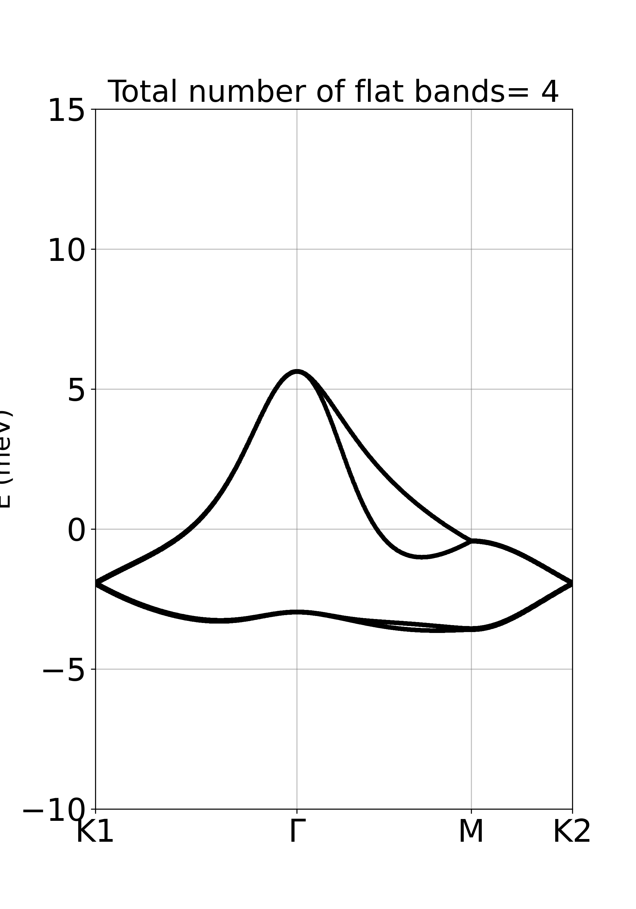

.. .. bibliograpy:: my_references.bib

Example 1: Band structure of TBG
--------------------------------

Here we demonstrate how to calculate band structre for magic angle twisted bilayer graphene (TBG).

First import ``ltbsymm`` and other libraries if you need, in this case also ``numpy``:

.. code:: ipython3

    import ltbsymm as ls
    import numpy as np

Create an object of TightBinding class:

.. code:: ipython3

    mytb = ls.TB()

Next, load the coordinate file. ``1.08_1AA.data`` is an example of relaxed structure using ``LAMMPS``. For detail of this relaxation you can contact its creator  `Dr. Jin Wang <jinwang@sissa.it>`_ .

.. code:: ipython3

    mytb.set_configuration('1.08_1AA.data', r_cut = 5.7, local_normal=True)

**r_cut** used to detect neighbors within a circular range around each individual cites.
**local_normal=True** clarifies whether to calculate the local normal vector, pointing out from surface locally (True) or use (0,0,1) as vertical normal to all sites (False). The former option is needed in case your structure is not flat, and out of plain deformations affects how orbitals interacts, see Slatter-Koster. Phys. Rev., 94:1498–1524, 1954. The latter is suitable (and faster) for flat geometries with negligible corrugation.

Depending on size of your system, you may want to save this initial configuration! This will help you to save time for next runs with the same data file and setting.

.. code:: ipython3

    mytb.save(configuration =True)

The heart of any band structure calculation is the Hamiltonian. In LTB-Symm you are completely free to define the Hamiltonian of your TB model! Define your it as you like, using features that are already developed.
In the case of TBG we define the Hamiltonian -- see our paper-- as:

.. (AS: which features, what constrains does it need to satisfy? At least in terms of coding; if these are better specified in the documentation, we need to say it). Ali: sure will do later.

.. math::

    H_{ij}= \frac{V_{pp\sigma}}{2} \left[ \left(\frac{\textbf{d}_{ij} \cdot \hat{n_i} }{ \mid\textbf{d}_{ij}\mid  }\right)^2 + \left(\frac{\textbf{d}_{ij} \cdot \hat{n_i} }{ \mid\textbf{d}_{ij}\mid  }\right)^2 \right]  +  V_{pp\pi}  \left[ 1-\frac{1}{2} \left( \left(\frac{\textbf{d}_{ij} \cdot \hat{n_j} }{ \mid\textbf{d}_{ij}\mid  }\right)^2 + \left(\frac{\textbf{d}_{ij} \cdot \hat{n_j} }{ \mid\textbf{d}_{ij}\mid  }\right)^2 \right) \right],

where :math:`V_{pp\sigma}` and :math:`V_{pp\pi}` are defined as

.. math::

    V_{pp\sigma} = V_{pp\sigma}^0 \; \exp{\left(-\frac{ \mid\textbf{d}_{ij}\mid -d_0}{r_0}\right)}, \;\;\; V_{pp\pi} = V_{pp\pi}^0 \; \exp{\left(-\frac{ \mid\textbf{d}_{ij}\mid -a_0}{r_0}\right)} .

.. (AS: perhaps some references? E.g. "This is essentially the Hamiltonian used in Ref ...." ) I added see our paper

This Hamiltonian translate into the following Python function:

.. code:: ipython3

    # Define Hamiltonian and fix the parameters of the Hamiltonian that are the same for all pairs
    def H_ij(v_ij, ez_i, ez_j, a0 = 1.42039011, d0 = 3.344, V0_sigam = +0.48, V0_pi = -2.7, r0 = 0.184* 1.42039011 * np.sqrt(3) ):
        """
            Args:
                d0: float
                    Distance between two layers. Notice d0 <= than minimum interlayer distance, otherwise you are exponentially increasing interaction!
                a0: float
                    Equilibrium distance between two neghibouring cites.
                V0_sigam: float
                    Slater-Koster parameters
                V0_pi: float
                    Slater-Koster parameters
                r0: float
                    Decay rate of the exponential
        """

        dd = np.linalg.norm(v_ij)
        V_sigam = V0_sigam * np.exp(-(dd-d0) / r0 )
        V_pi    = V0_pi    * np.exp(-(dd-a0) / r0 )

        tilt_1 = np.power(np.dot(v_ij, ez_i)/ dd, 2)
        tilt_2 = np.power(np.dot(v_ij, ez_j)/ dd, 2)
        t_ij =  V_sigam * (tilt_1+tilt_2)/2 + V_pi * (1- (tilt_1 + tilt_2)/2)

        return t_ij

Now that the Hamiltonian is defined, it is time to define the reciprocal space, i.e. the right Brillouin zone for our system.
In the simple case of TBG, LTB-Symm is able to detect mini brillouin zone (MBZ) automatically.

.. code:: ipython3

    # Define MBZ and set K-points
    mytb.MBZ()
    mytb.set_Kpoints(['K1','Gamma','M2', 'K2'] , N=32)

   
We may define a specific path inside the MBZ :py:func:`set_Kpoints()`, with total N=32 K-points which will be autmatically distributed along the segments.

.. (AS: I would add a reference to Bilbao, e.g. "The high symmetry points in a BZ and the paths connecting them can be found at <bilbao website>) Ali: I assume users of this code understand BZ

Now the physics is set, and electronic bands are ready to calculate.

.. code:: ipython3

    # For twisted bilayer graphene sigma=np.abs(V0_pi-V0_sigam)/2 . An approximate value where flat bands are located
    mytb.calculate_bands(H_ij, n_eigns = 4, sigma=np.abs(-2.7-0.48)/2, solver='primme', return_eigenvectors = False)

It is always a good idea to save the calculation!

.. code:: ipython3

    mytb.save(bands=True)

You could run this code in parallel using MPI. For example on 4 cores, this calculation should take only around 200 seconds

.. code-block:: console

   $ mpirun -n 4 python input_calculate.py

Congratulation! Now that bands have been computed, it is time for fun!

Before plotting, let us see if there are any flatbands

.. code:: ipython3

    # Detect if there are any flatbands
    mytb.detect_flat_bands()

    
Then you realize there are 4 flat bands, but are not centered around zero. This could happen, simply because the approximate value of **sigma** that is used in :py:func:`mytb.calculate_bands()` has no knowledge of Fermi level. This can be easily fixed simply by recentering flat bands around a given K-point (in this case K1, where Dirac cone is centered): 

.. (AS: this is the culprit but not the reason. Can we add in one sentence how this sigma is linked to the shift?). Ali: no It's an experimental approximation, I don't know /don't care the link. 
.. (AS: is this really a random K points? Or is this where the Dirac cone are, so the point where you know the Fermi level must lie?) Ali: dirac cone
.. (AS: can't you put the output of the cell as well?) Ali: I don't understand

.. code:: ipython3

    # Set Fermi level by shifting E=0 to the avergage energies of flat bands at point e.g. 'K1'
    mytb.shift_2_zero('K1', np.array([0,1,2,3]))

Finally, you can plot and save the band structure.

.. code:: ipython3

    # Plot bands and modify figure as you like
    plot = mytb.plotter_bands(color_ ='C0')
    plot.set_ylim([-10,15])
    plt.savefig('out_1.08_1AA/'+'Bands_'+ ".png", dpi=150)

    plt.show()

Nice! Perhaps a bit spare. We could increase the density by setting N=1000 in :py:func:`set_Kpoints()` and obtain a nicer-looking plot (that would certainly takes more than 200 seconds!):

.. note::

    Alternatively you could close the seassion and load preveoiusly calculate bands:

    .. code:: ipython3

        mytb = ls.TB()
        mytb.load('out_1.08_1AA', bands='bands_.npz', configuration='configuration_.npz')
        plot = mytb.plotter_bands(color_ ='C0')

.. warning::

    In case of using `mpirun`, it is better to assign only one core for plotting functions:

    .. code:: ipython3

        import numpy as np
        import ltbsymm as ls
        import matplotlib.pyplot as plt
        from mpi4py import MPI

        comm = MPI.COMM_WORLD
        rank = comm.Get_rank()

        if rank == 0:
            mytb = ls.TB()
            mytb.load('out_1.08_1AA', bands='bands_.npz', configuration='configuration_.npz')
            plot = mytb.plotter_bands(color_ ='C0')
            plt.show()

        MPI.Finalize()
