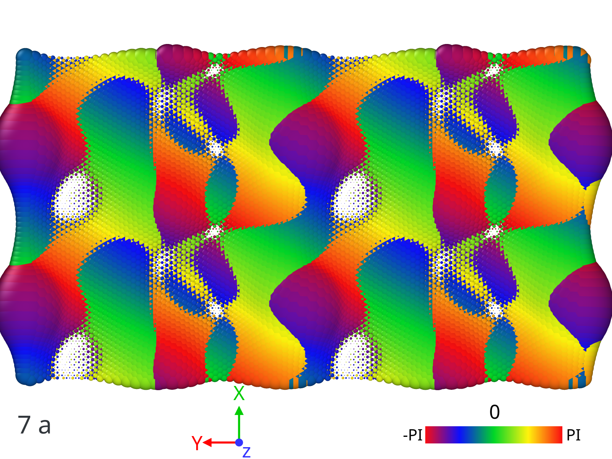
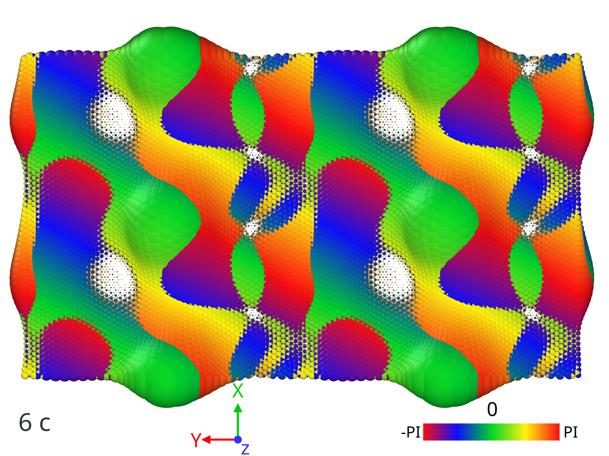

Example 2: Symmetry operations and wave vectors parity
------------------------------------------------------

In this example I show how to investigate parities of wave vectors, for any symmetry operations at a any given point of Brillouin zone.
Such tool could be usefull to understand topological properties of band structure.  
As an example, here, we consider two unitcells of twisted bilayer graphene at magic angle 1.08 degrees.

.. note::

   This project is under active development. ``symmetry`` module is fully developed for rectangular lattice. For rhombic, mimicing the spirit, implementation is in progress. 
   
   
First let's calculate eigen vectors at high symmetry points:

.. code:: ipython3

    import sys
    import numpy as np
    import ltbsymm as ls
    from mpi4py import MPI

    comm = MPI.COMM_WORLD
    rank = comm.Get_rank()

    # Start a TB object and set/load configuration
    mytb = ls.TB()
    mytb.set_configuration('1.08_2AA.data', r_cut = 5.7, local_normal=True, nl_method='RS')
    mytb.save(configuration =True)

    # Define Hamiltonian and fix the parameters of the Hamiltonian that are the same for all pairs 
    def H_ij(v_ij, ez_i, ez_j, a0 = 1.42039011, d0 = 3.344, V0_sigam = +0.48, V0_pi = -2.7, r0 = 0.184* 1.42039011 * np.sqrt(3) ):
        """
            Args:
                d0: float
                    Distance between two layers. Notice d0 <= than minimum interlayer distance, otherwise you are exponentially increasing interaction!
                a0: float
                    Equilibrium distance between two neghibouring cites.
                V0_sigam: float
                    Slater-Koster parameters
                V0_pi: float
                    Slater-Koster parameters
                r0: float
                    Decay rate of the exponential
        """
        #print(v_ij, ez_i, ez_j)
        dd = np.linalg.norm(v_ij)
        V_sigam = V0_sigam * np.exp(-(dd-d0) / r0 )
        V_pi    = V0_pi    * np.exp(-(dd-a0) / r0 )
        
        tilt_1 = np.power(np.dot(v_ij, ez_i)/ dd, 2)
        tilt_2 = np.power(np.dot(v_ij, ez_j)/ dd, 2)
        t_ij =  V_sigam * (tilt_1+tilt_2)/2 + V_pi * (1- (tilt_1 + tilt_2)/2) 
        
        return t_ij

    # Define MBZ and set K-points
    mytb.MBZ()
    mytb.set_Kpoints(['X','Gamma','Y', 'W'], N=0, saveH=True)

    # For twisted bilayer graphene sigma=np.abs(V0_pi-V0_sigam)/2 . An approximate value that flat bands are located
    mytb.calculate_bands(H_ij, n_eigns = 8, sigma=np.abs(-2.7-0.48)/2, solver='primme', tbt='type2', return_eigenvectors = True) 

    mytb.save(bands=True)

    MPI.Finalize()

A similar code to above is explained in details for a similar case (Example 1). 

.. note:: 
    Once a band structure calculation is done, you can always save using
    
    .. code:: ipython3
    
        mytb.save(bands=True, configuration=True)
        
    This is very conveninet, becasue for later application or symmetry analysis you can just simply load, for example:    
    
    .. code:: ipython3
    
        mytb.load('out_1.08_2AA', bands='bands_.npz', configuration='configuration_.npz')
    
    There is no need to re-calculate from begining
    

Having wave vectors, we can proceed to create a Symm object. 

    
.. code:: ipython3

    if rank == 0:

        sm = ls.Symm(mytb)
        
        sm.build_map('C2z',['-X+1/2*Rx','-Y+1/2*Ry','Z'], atol=0.3, plot = True)
        sm.build_map('C2y',['-X','Y+1/2*Ry','-Z'], atol=0.3)
        sm.build_map('C2x',['X+1/2*Rx','-Y','-Z'], atol=0.3)

You may define all symmetry operations of the space group. :py:func:`build_map()` simply verifies if the suggest symmetry exists, and if so, and how does it map with existing orbital indices. 

.. In picture below, all the red dots(operated) are siting on green(unitcell) ones. Meaning the C2z is a symmetry operation of this unitcell. (Some atoms in the boundary might have been shift to the otherside, which is not a problem)

.. .. image:: output_2_1.png

The second argument of :py:func:`build_map()` should be arithmetics math operations in following order: [operation for X, operation for Y, operation for Z]

The Arithmetics symbols and namespaces below are acceptable:

.. code:: none

    +, -, /, *, X, Y, Z, Rx, Ry, and Rz. 
    
Rx, Ry, and Rz are lattice vectors along their directions. X, Y, and Z are coordinates of cites inside unitcell.

In our example 1/2*Rx does a non-symmorphic translation.

Next, build (N*N) matrices for the verified symmetry operations.

.. code:: ipython3

    # Make the operation Matrix at a given point of receiprocal space
    sm.make_Cmat('C2x', 'Gamma')
    sm.make_Cmat('C2y', 'Gamma')
    sm.make_Cmat('C2z', 'Gamma')

.. sm.load('out_1.08_2AA', 'Symm_.npz')

And we can simply check if they make sense, by taking the square

.. code:: ipython3

    # Check operations square and how they commute 
    sm.check_square('C2x', 'Gamma', ftol = 30)
    sm.check_square('C2y', 'Gamma', ftol = 30)
    sm.check_square('C2z', 'Gamma', ftol = 30)
    

We may need to know how the symmetry operations commute, or anti-commute !

.. code:: ipython3
    
    sm.check_commute('C2x', 'C2y', 'Gamma', ftol=30) 
    sm.check_commute('C2z', 'C2y', 'Gamma', ftol=30) 
    sm.check_commute('C2x', 'C2z', 'Gamma', ftol=30) 

In this case results like this:

.. code:: console

    C2x @ C2x = identity at Gamma
    C2y @ C2y = identity at Gamma
    C2z @ C2z = identity at Gamma
    [C2x, C2y] do commute at Gamma
    [C2z, C2y] do commute at Gamma
    [C2x, C2z] do commute at Gamma

We are inerested in symmetry operation on wave vectors associated with flat bands, therefore first we detect if there are any flat bands:
    
.. code:: ipython3

    mytb.detect_flat_bands()

Results in:

.. code:: console

    8  flat bands detected

    
Now we can check if (flat) wave vectors respect the symmetries that we defined: 

.. code:: ipython3

    sm.vector_diag('Gamma', name1='C2x', subSize = 4, skip_diag = True)

    
Which results in:

.. code:: console

    
    
    ======================
    ** vector_diag at Gamma **
    ======================
    
    
    Subspace 1.0 with energies:
    0.005687156959874318
    0.005675662193339814
    -0.0003969110247522556
    -0.00041691802874066486
    <psi| C2z |psi>
    [[-0.8+0.j , 0.5-0.2j,-0. +0.j ,-0. +0.j ],
     [ 0.5+0.2j, 0.8+0.j , 0. -0.j ,-0. +0.j ],
     [-0. -0.j , 0. +0.j , 0.9+0.j , 0.3-0.j ],
     [-0. -0.j ,-0. -0.j , 0.3+0.j ,-0.9+0.j ]]
    <psi| C2y |psi>
    [[ 1.+0.j, 0.-0.j, 0.-0.j,-0.+0.j],
     [ 0.+0.j, 1.+0.j, 0.-0.j,-0.+0.j],
     [ 0.+0.j, 0.+0.j,-1.+0.j,-0.+0.j],
     [-0.-0.j,-0.-0.j,-0.-0.j,-1.+0.j]]
    <psi| C2x |psi>
    [[-0.8+0.j , 0.5-0.2j, 0. -0.j ,-0. +0.j ],
     [ 0.5+0.2j, 0.8+0.j , 0. -0.j , 0. -0.j ],
     [ 0. +0.j , 0. +0.j ,-0.9+0.j ,-0.3+0.j ],
     [-0. -0.j , 0. +0.j ,-0.3-0.j , 0.9+0.j ]]
    
    Subspace 2.0 with energies:
    -0.003000614802293855
    -0.003018659755200659
    -0.0035570670624436307
    -0.0036018736346046243
    <psi| C2z |psi>
    [[-0.5+0.j ,-0.1+0.9j, 0. +0.j ,-0. +0.j ],
     [-0.1-0.9j, 0.5+0.j ,-0. +0.j ,-0. -0.j ],
     [ 0. -0.j ,-0. -0.j , 0.5+0.j ,-0.3+0.8j],
     [-0. -0.j ,-0. +0.j ,-0.3-0.8j,-0.5-0.j ]]
    <psi| C2y |psi>
    [[-1.+0.j, 0.-0.j, 0.+0.j,-0.+0.j],
     [ 0.+0.j,-1.+0.j,-0.+0.j,-0.-0.j],
     [ 0.-0.j,-0.-0.j, 1.+0.j,-0.+0.j],
     [-0.-0.j,-0.+0.j,-0.-0.j, 1.+0.j]]
    <psi| C2x |psi>
    [[ 0.5+0.j , 0.1-0.9j,-0. -0.j ,-0. +0.j ],
     [ 0.1+0.9j,-0.5+0.j , 0. -0.j ,-0. -0.j ],
     [-0. +0.j , 0. +0.j , 0.5+0.j ,-0.3+0.8j],
     [-0. -0.j ,-0. +0.j ,-0.3-0.8j,-0.5+0.j ]]

As you can see there are offdiagonal terms in :code:`C2x` and :code:`C2z` space, which don't allow us to read parities. 
Unfortunately, there is no guarantee that ``LANCZOS`` wave vectors would be diagonal in this subspace. 

Hopefully, we can try to see if they are diagonalizable

.. code:: ipython3

    # Diagonalize wave vectors respect to a given symmetry 
    sm.vector_diag('Gamma', name1='C2z', name2= 'C2x', subSize = 4, rtol=0.1, skip_diag = False)

.. code:: console

    
    
    ======================
    ** vector_diag at Gamma **
    ======================
    
    
    Diagonalizing flat bands subspace 1.0 with energies:
    0.005687156959874318
    0.005675662193339814
    -0.0003969110247522556
    -0.00041691802874066486
    <psi| C2z |psi>
    [[-0.8+0.j , 0.5-0.2j,-0. +0.j ,-0. +0.j ],
     [ 0.5+0.2j, 0.8+0.j , 0. -0.j ,-0. +0.j ],
     [-0. -0.j , 0. +0.j , 0.9+0.j , 0.3-0.j ],
     [-0. -0.j ,-0. -0.j , 0.3+0.j ,-0.9+0.j ]]
    Diagonalizing respect to  C2z
    eignvalues:  [-1.-0.j, 1.+0.j, 1.+0.j,-1.-0.j]
    
     Second off-diagonalizing respect to  C2x
    upper_block is
     [[-1.+0.j, 0.-0.j],
     [ 0.+0.j, 1.+0.j]]
    eignvalues:  [-1.-0.j, 1.-0.j]
    lower_block is
     [[-1.+0.j,-0.+0.j],
     [-0.-0.j, 1.+0.j]]
    eignvalues:  [-1.-0.j, 1.+0.j]
    
    Final check if diagonalized respect to  C2z
    [[-1.+0.j,-0.+0.j, 0.+0.j, 0.-0.j],
     [-0.-0.j, 1.+0.j,-0.+0.j, 0.+0.j],
     [ 0.-0.j,-0.-0.j, 1.+0.j,-0.+0.j],
     [ 0.+0.j,-0.-0.j,-0.-0.j,-1.+0.j]]
    
    Final check if diagonalized respect to  C2y
    [[ 1.+0.j, 0.-0.j, 0.-0.j,-0.+0.j],
     [ 0.+0.j, 1.+0.j,-0.+0.j, 0.-0.j],
     [ 0.+0.j,-0.-0.j,-1.+0.j,-0.+0.j],
     [-0.-0.j, 0.+0.j,-0.-0.j,-1.+0.j]]
    
    Final check if diagonalized respect to  C2x
    [[-1.+0.j, 0.+0.j,-0.+0.j, 0.-0.j],
     [ 0.+0.j, 1.+0.j,-0.+0.j, 0.-0.j],
     [-0.-0.j,-0.-0.j,-1.+0.j, 0.+0.j],
     [ 0.+0.j, 0.+0.j, 0.+0.j, 1.+0.j]]
    
    Diagonalizing flat bands subspace 2.0 with energies:
    -0.003000614802293855
    -0.003018659755200659
    -0.0035570670624436307
    -0.0036018736346046243
    <psi| C2z |psi>
    [[-0.5+0.j ,-0.1+0.9j, 0. +0.j ,-0. +0.j ],
     [-0.1-0.9j, 0.5+0.j ,-0. +0.j ,-0. -0.j ],
     [ 0. -0.j ,-0. -0.j , 0.5+0.j ,-0.3+0.8j],
     [-0. -0.j ,-0. +0.j ,-0.3-0.8j,-0.5-0.j ]]
    Diagonalizing respect to  C2z
    eignvalues:  [-1.-0.j,-1.+0.j, 1.+0.j, 1.-0.j]
    
     Second off-diagonalizing respect to  C2x
    upper_block is
     [[ 1.+0.j,-0.+0.j],
     [-0.-0.j,-1.+0.j]]
    eignvalues:  [ 1.+0.j,-1.+0.j]
    lower_block is
     [[-1.+0.j,-0.+0.j],
     [-0.-0.j, 1.+0.j]]
    eignvalues:  [-1.+0.j, 1.-0.j]
    
    Final check if diagonalized respect to  C2z
    [[-1.+0.j, 0.-0.j, 0.-0.j,-0.-0.j],
     [ 0.+0.j,-1.+0.j,-0.+0.j,-0.+0.j],
     [ 0.+0.j, 0.-0.j, 1.+0.j, 0.-0.j],
     [-0.+0.j,-0.-0.j, 0.+0.j, 1.+0.j]]
    
    Final check if diagonalized respect to  C2y
    [[-1.+0.j, 0.-0.j,-0.+0.j, 0.+0.j],
     [ 0.+0.j, 1.+0.j, 0.-0.j, 0.+0.j],
     [-0.-0.j, 0.+0.j,-1.+0.j,-0.+0.j],
     [ 0.-0.j, 0.-0.j,-0.-0.j, 1.+0.j]]
    
    Final check if diagonalized respect to  C2x
    [[ 1.+0.j, 0.-0.j,-0.+0.j, 0.+0.j],
     [ 0.+0.j,-1.+0.j,-0.+0.j, 0.+0.j],
     [-0.-0.j,-0.-0.j,-1.+0.j, 0.+0.j],
     [ 0.-0.j, 0.-0.j, 0.-0.j, 1.+0.j]]

Now we see, they are successfully diagonalized. So we can read the parities. 

Below are two wave vectors with imaginary-odd parity under non-symmorphic `C2x` symmetry. Somethis also cool to see :)

Visualized by ``OVITO``.
Colors, and size reperesenting their phase and amplitude as a function of (x,y). Unitcell has been repeated 4 times for visibility. 

.. .. code:: ipython3

    # You can save sm object 
    sm.save()

