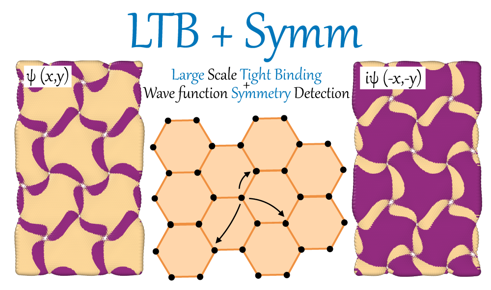

.. LB-Symm documentation master file, created by
   sphinx-quickstart on Sat Apr 29 10:19:53 2023.
   You can adapt this file completely to your liking, but it should at least
   contain the root `toctree` directive.

.. raw:: html

   <meta name="google-site-verification" content="HrCRMRpgWAkYt_dcm84kL7Ms86rxhfxCZS2AOuTwv2E" />

.. .. raw:: html

   <!-- Google tag (gtag.js) -->
   
   

Welcome to LB-Symm's documentation!
===================================

.. note::

   This project is under active development. Feel free to contact us directly for any question, we can give you advise if this code is suitable for your project. Email: `khsrali@gmail.com <khsrali@gmail.com>`_

.. note::

   Possible collaboration with related packages are welcome!

.. include:: home.rst

.. toctree::

   Home <self>
   Introduction
   examples
   Installation
   ltbsymm
   Citation

..  Tutorial
..
   Overview
   modules
   Summary
   API reference <_autosummary/mytoolbox>

.. .. toctree::
   :maxdepth: 3
   :caption: Contents:

Indices and tables
==================

* :ref:`genindex`
* :ref:`modindex`
* :ref:`search`
