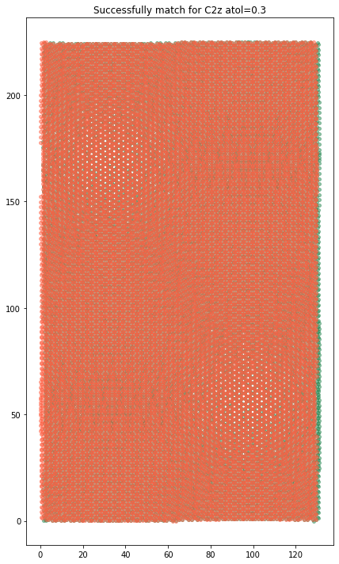

.. code:: ipython3

    import sys
    import numpy as np
    import ltbsymm as ls
    
    # Start a TB object and set/load configuration
    mytb = ls.TB()
    mytb.load('out_1.08_2AA', bands='bands_.npz', configuration='configuration_.npz')

.. code:: console

    TB object created
    loading  out_1.08_2AA/configuration_.npz
    loading  out_1.08_2AA/bands_.npz

.. code:: ipython3

    # Start a Symm object and set/load configuration
    sm = ls.Symm(mytb)

.. code:: console

    Symm object created

.. code:: ipython3

    # Define all symmetry operations of the space group
    sm.build_map('C2z',['-X+1/2*Rx','-Y+1/2*Ry','Z'], atol=0.3, plot = True)
    sm.build_map('C2y',['-X','Y+1/2*Ry','-Z'], atol=0.3)
    sm.build_map('C2x',['X+1/2*Rx','-Y','-Z'], atol=0.3)
    
    # Make the operation Matrix at a given point of receiprocal space
    sm.make_Cmat('C2x', 'Gamma')
    sm.make_Cmat('C2y', 'Gamma')
    sm.make_Cmat('C2z', 'Gamma')

.. code:: console

    Operation C2z is defined as  non-symmorphic -X+1/2*Rx, -Y+1/2*Ry, Z
    Symmetry map for C2z has built successfully.  218  where marginal at boundaries.

.. code:: console

    Operation C2y is defined as  non-symmorphic -X, Y+1/2*Ry, -Z
    Symmetry map for C2y has built successfully.  218  where marginal at boundaries.
    Operation C2x is defined as  non-symmorphic X+1/2*Rx, -Y, -Z
    Symmetry map for C2x has built successfully.  216  where marginal at boundaries.
    **Making C2x matrix at Gamma:[0. 0. 0.] **
    **Making C2y matrix at Gamma:[0. 0. 0.] **

.. code:: console

    /home/ali/Apt/anaconda3/lib/python3.8/site-packages/scipy/sparse/_lil.py:326: ComplexWarning: Casting complex values to real discards the imaginary part
      x = self.dtype.type(x)

.. code:: console

    **Making C2z matrix at Gamma:[0. 0. 0.] **

.. code:: ipython3

    # Check operations square and how they commute 
    sm.check_square('C2x', 'Gamma', ftol = 30)
    sm.check_square('C2y', 'Gamma', ftol = 30)
    sm.check_square('C2z', 'Gamma', ftol = 30)
    sm.check_commute('C2x', 'C2y', 'Gamma', ftol=30) 
    sm.check_commute('C2z', 'C2y', 'Gamma', ftol=30) 
    sm.check_commute('C2x', 'C2z', 'Gamma', ftol=30) 

.. code:: console

    C2x @ C2x = identity at Gamma
    C2y @ C2y = identity at Gamma
    C2z @ C2z = identity at Gamma
    [C2x, C2y] do commute at Gamma
    [C2z, C2y] do commute at Gamma
    [C2x, C2z] do commute at Gamma

.. code:: ipython3

    # Detect and identify flat bands
    mytb.detect_flat_bands()

.. code:: console

    8  flat bands detected

.. code:: ipython3

    # Check if wave functions are diagonal respect to symmetries
    sm.vector_diag('Gamma', name1='C2x', subSize = 4, skip_diag = True)

.. code:: console

    
    
    ======================
    ** vector_diag at Gamma **
    ======================
    
    
    Subspace 1.0 with energies:
    0.005687156959874318
    0.005675662193339814
    -0.0003969110247522556
    -0.00041691802874066486
    <psi| C2z |psi>
    [[-0.8+0.j , 0.5-0.2j,-0. +0.j ,-0. +0.j ],
     [ 0.5+0.2j, 0.8+0.j , 0. -0.j ,-0. +0.j ],
     [-0. -0.j , 0. +0.j , 0.9+0.j , 0.3-0.j ],
     [-0. -0.j ,-0. -0.j , 0.3+0.j ,-0.9+0.j ]]
    <psi| C2y |psi>
    [[ 1.+0.j, 0.-0.j, 0.-0.j,-0.+0.j],
     [ 0.+0.j, 1.+0.j, 0.-0.j,-0.+0.j],
     [ 0.+0.j, 0.+0.j,-1.+0.j,-0.+0.j],
     [-0.-0.j,-0.-0.j,-0.-0.j,-1.+0.j]]
    <psi| C2x |psi>
    [[-0.8+0.j , 0.5-0.2j, 0. -0.j ,-0. +0.j ],
     [ 0.5+0.2j, 0.8+0.j , 0. -0.j , 0. -0.j ],
     [ 0. +0.j , 0. +0.j ,-0.9+0.j ,-0.3+0.j ],
     [-0. -0.j , 0. +0.j ,-0.3-0.j , 0.9+0.j ]]
    
    Subspace 2.0 with energies:
    -0.003000614802293855
    -0.003018659755200659
    -0.0035570670624436307
    -0.0036018736346046243
    <psi| C2z |psi>
    [[-0.5+0.j ,-0.1+0.9j, 0. +0.j ,-0. +0.j ],
     [-0.1-0.9j, 0.5+0.j ,-0. +0.j ,-0. -0.j ],
     [ 0. -0.j ,-0. -0.j , 0.5+0.j ,-0.3+0.8j],
     [-0. -0.j ,-0. +0.j ,-0.3-0.8j,-0.5-0.j ]]
    <psi| C2y |psi>
    [[-1.+0.j, 0.-0.j, 0.+0.j,-0.+0.j],
     [ 0.+0.j,-1.+0.j,-0.+0.j,-0.-0.j],
     [ 0.-0.j,-0.-0.j, 1.+0.j,-0.+0.j],
     [-0.-0.j,-0.+0.j,-0.-0.j, 1.+0.j]]
    <psi| C2x |psi>
    [[ 0.5+0.j , 0.1-0.9j,-0. -0.j ,-0. +0.j ],
     [ 0.1+0.9j,-0.5+0.j , 0. -0.j ,-0. -0.j ],
     [-0. +0.j , 0. +0.j , 0.5+0.j ,-0.3+0.8j],
     [-0. -0.j ,-0. +0.j ,-0.3-0.8j,-0.5+0.j ]]

.. code:: ipython3

    # Diagonalize wave vectors respect to a given symmetry 
    sm.vector_diag('Gamma', name1='C2z', name2= 'C2x', subSize = 4, rtol=0.1, skip_diag = False)

.. code:: console

    
    
    ======================
    ** vector_diag at Gamma **
    ======================
    
    
    Diagonalizing flat bands subspace 1.0 with energies:
    0.005687156959874318
    0.005675662193339814
    -0.0003969110247522556
    -0.00041691802874066486
    <psi| C2z |psi>
    [[-0.8+0.j , 0.5-0.2j,-0. +0.j ,-0. +0.j ],
     [ 0.5+0.2j, 0.8+0.j , 0. -0.j ,-0. +0.j ],
     [-0. -0.j , 0. +0.j , 0.9+0.j , 0.3-0.j ],
     [-0. -0.j ,-0. -0.j , 0.3+0.j ,-0.9+0.j ]]
    Diagonalizing respect to  C2z
    eignvalues:  [-1.-0.j, 1.+0.j, 1.+0.j,-1.-0.j]
    
     Second off-diagonalizing respect to  C2x
    upper_block is
     [[-1.+0.j, 0.-0.j],
     [ 0.+0.j, 1.+0.j]]
    eignvalues:  [-1.-0.j, 1.-0.j]
    lower_block is
     [[-1.+0.j,-0.+0.j],
     [-0.-0.j, 1.+0.j]]
    eignvalues:  [-1.-0.j, 1.+0.j]
    
    Final check if diagonalized respect to  C2z
    [[-1.+0.j,-0.+0.j, 0.+0.j, 0.-0.j],
     [-0.-0.j, 1.+0.j,-0.+0.j, 0.+0.j],
     [ 0.-0.j,-0.-0.j, 1.+0.j,-0.+0.j],
     [ 0.+0.j,-0.-0.j,-0.-0.j,-1.+0.j]]
    
    Final check if diagonalized respect to  C2y
    [[ 1.+0.j, 0.-0.j, 0.-0.j,-0.+0.j],
     [ 0.+0.j, 1.+0.j,-0.+0.j, 0.-0.j],
     [ 0.+0.j,-0.-0.j,-1.+0.j,-0.+0.j],
     [-0.-0.j, 0.+0.j,-0.-0.j,-1.+0.j]]
    
    Final check if diagonalized respect to  C2x
    [[-1.+0.j, 0.+0.j,-0.+0.j, 0.-0.j],
     [ 0.+0.j, 1.+0.j,-0.+0.j, 0.-0.j],
     [-0.-0.j,-0.-0.j,-1.+0.j, 0.+0.j],
     [ 0.+0.j, 0.+0.j, 0.+0.j, 1.+0.j]]
    
    Diagonalizing flat bands subspace 2.0 with energies:
    -0.003000614802293855
    -0.003018659755200659
    -0.0035570670624436307
    -0.0036018736346046243
    <psi| C2z |psi>
    [[-0.5+0.j ,-0.1+0.9j, 0. +0.j ,-0. +0.j ],
     [-0.1-0.9j, 0.5+0.j ,-0. +0.j ,-0. -0.j ],
     [ 0. -0.j ,-0. -0.j , 0.5+0.j ,-0.3+0.8j],
     [-0. -0.j ,-0. +0.j ,-0.3-0.8j,-0.5-0.j ]]
    Diagonalizing respect to  C2z
    eignvalues:  [-1.-0.j,-1.+0.j, 1.+0.j, 1.-0.j]
    
     Second off-diagonalizing respect to  C2x
    upper_block is
     [[ 1.+0.j,-0.+0.j],
     [-0.-0.j,-1.+0.j]]
    eignvalues:  [ 1.+0.j,-1.+0.j]
    lower_block is
     [[-1.+0.j,-0.+0.j],
     [-0.-0.j, 1.+0.j]]
    eignvalues:  [-1.+0.j, 1.-0.j]
    
    Final check if diagonalized respect to  C2z
    [[-1.+0.j, 0.-0.j, 0.-0.j,-0.-0.j],
     [ 0.+0.j,-1.+0.j,-0.+0.j,-0.+0.j],
     [ 0.+0.j, 0.-0.j, 1.+0.j, 0.-0.j],
     [-0.+0.j,-0.-0.j, 0.+0.j, 1.+0.j]]
    
    Final check if diagonalized respect to  C2y
    [[-1.+0.j, 0.-0.j,-0.+0.j, 0.+0.j],
     [ 0.+0.j, 1.+0.j, 0.-0.j, 0.+0.j],
     [-0.-0.j, 0.+0.j,-1.+0.j,-0.+0.j],
     [ 0.-0.j, 0.-0.j,-0.-0.j, 1.+0.j]]
    
    Final check if diagonalized respect to  C2x
    [[ 1.+0.j, 0.-0.j,-0.+0.j, 0.+0.j],
     [ 0.+0.j,-1.+0.j,-0.+0.j, 0.+0.j],
     [-0.-0.j,-0.-0.j,-1.+0.j, 0.+0.j],
     [ 0.-0.j, 0.-0.j, 0.-0.j, 1.+0.j]]

.. code:: ipython3

    # You can save sm object 
    sm.save()

